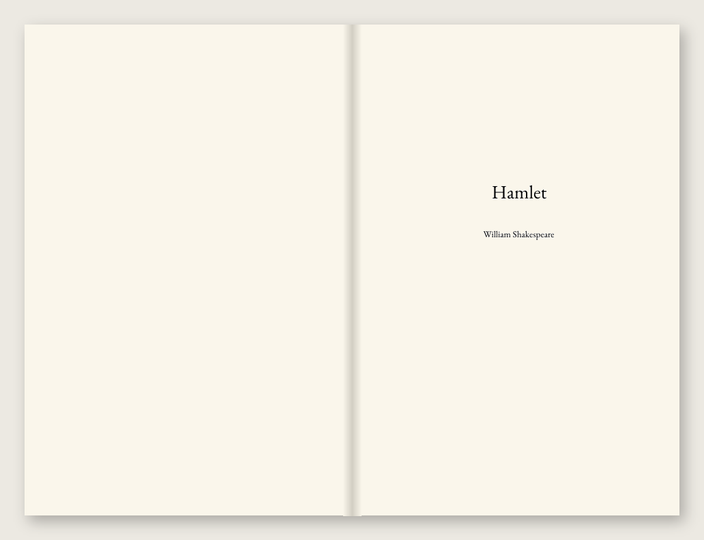
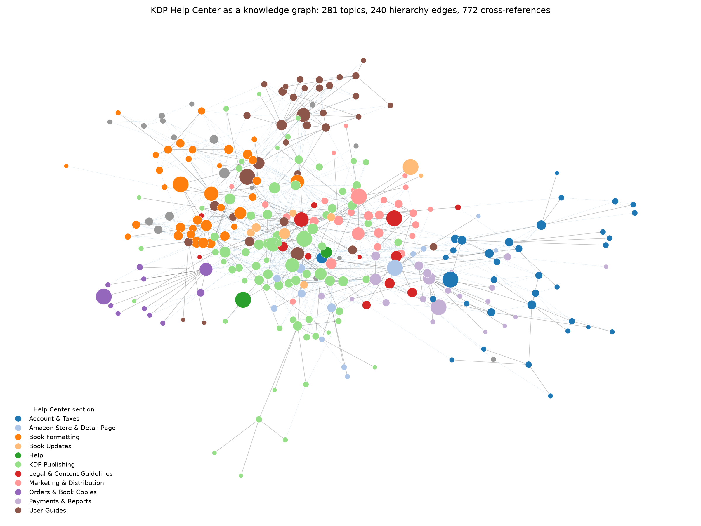
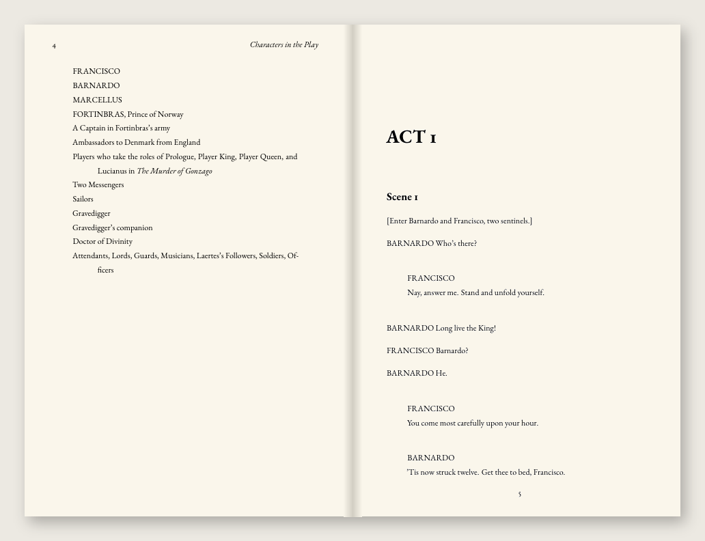

<h1 align="center">kdp-book-creator</h1>

<p align="center"><b>Formatting, not writing. Literature stays in human hands.</b><br>
This tool never generates, edits or rewrites a word of your book.<br>
You bring the finished manuscript; it hands back files Amazon KDP will accept.</p>

<p align="center">
  <a href="https://skills.sh/LaFerraille/kdp-book-creator"></a>
  <a href="https://github.com/LaFerraille/kdp-book-creator/actions/workflows/tests.yml"></a>
  <a href="LICENSE"></a>
  
  
</p>

<p align="center">
  
  &nbsp;
  
</p>
<p align="center"><sub>Plain text in, and out: a 203-page 6 × 9" paperback, its cover and an EPUB, all passing KDP's checks. See <a href="docs/example-session.md">the full session</a>.</sub></p>

---

A Claude Code plugin that interviews you about your book, then produces:

- the **interior PDF**: trim, margins, gutter and bleed computed from KDP's published tables
- the **wrap cover PDF**: spine width computed from the *real* page count and paper stock
- a **reflowable EPUB 3** for Kindle

Every file is **preflighted against KDP's requirements** before you upload it.
Every KDP rule the tool relies on is looked up in a **local knowledge graph of
KDP's own Help Center**, built on your machine, never guessed.

## Contents

- [Quick start](#quick-start)
- [Commands](#commands)
- [The KDP knowledge graph](#the-kdp-knowledge-graph)
- [Walkthrough: Hamlet](#walkthrough-hamlet)
- [What it guarantees](#what-it-guarantees)
- [How it works](#how-it-works)
- [What it does not do](#what-it-does-not-do)
- [Contributing](#contributing) · [License](#license)

## Quick start

### 1. Install the plugin

In Claude Code, add this repository as a plugin marketplace, then install:

```
/plugin marketplace add LaFerraille/kdp-book-creator
/plugin install kdp-book-creator@kdp-book-creator
```

<details>
<summary>Other ways: skills.sh, or a plain clone</summary>

**As a skill only** (Claude Code, Cursor, Codex and other agents), via
[skills.sh](https://skills.sh/LaFerraille/kdp-book-creator):

```bash
npx skills add LaFerraille/kdp-book-creator
```

The skill fetches the engine (`~/.kdp-book-creator`) on first use.

**From a clone**, without Claude Code:

```bash
git clone https://github.com/LaFerraille/kdp-book-creator
cd kdp-book-creator
bin/kdp doctor            # creates its own virtualenv on first run
bin/kdp wiki build
bin/kdp build my-manuscript.md --title "…" --author "…"
```
</details>

### 2. Install a LaTeX engine

LaTeX is what typesets the interior and the cover. The plugin's `kdp` command
sets up its own Python environment; the engine is the one thing it can't
install for you.

```bash
# macOS
brew install --cask basictex          # or: MacTeX, TinyTeX, Tectonic
sudo tlmgr install memoir polyglossia xpatch ebgaramond
# Debian / Ubuntu
sudo apt install texlive-xetex texlive-latex-extra texlive-fonts-extra
#   Debian's EB Garamond lacks the Initials font it loads; kdp doctor says so.
#   Fetch it from CTAN (fonts/ebgaramond/opentype/EBGaramond-Initials.otf) into
#   $(kpsewhich -var-value TEXMFHOME)/fonts/opentype/
# Windows
winget install MiKTeX.MiKTeX          # installs packages on demand
```

For a book that isn't in English, add its hyphenation patterns
(`tlmgr install hyphen-french`, `hyphen-spanish`, `hyphen-german`,
`hyphen-italian` or `hyphen-portuguese`). Without them a French book gets
English word-breaking on every page and still passes every other check, so
`kdp doctor` looks for them explicitly.

### 3. Check, then build

```
/kdp-wiki                       build the KDP knowledge graph (once, a few minutes)
/kdp-book my-manuscript.md      the interview, then interior + cover + ebook
```

`kdp doctor` names anything missing and the command that installs it.
Finished files land in `./build/`, named after the book and the KDP upload
field they belong to.

## Commands

| Command | What it does |
|---|---|
| `/kdp-book [file]` | The full interview and build. Without a file, it finds the manuscript and asks you to confirm. |
| `/kdp-cover` | Rebuilds the cover alone from the saved page count, e.g. after changing the blurb. Takes seconds. |
| `/kdp-check file.pdf` | Preflights a PDF you made elsewhere against KDP's requirements. |
| `/kdp-wiki` | Scrapes the KDP Help Center and indexes it as a local knowledge graph. |
| `/kdp-chat <question>` | Asks anything about KDP rules, your book in progress or what to do next, answered from the graph with sources. |

Markdown, plain text and DOCX are read directly. `.odt`, `.rtf` and `.html`
go through [pandoc](https://pandoc.org). PDF is not accepted as input: it
stores positioned glyphs, not chapters.

## The KDP knowledge graph

KDP rejects files over specifics: a gutter 0.02" too narrow, a trim size that
can't hold the page count, a spine computed for the wrong paper. And it changes
those specifics without notice. So the first thing the plugin does, like
[`/understand`](https://github.com/Egonex-AI/Understand-Anything) does for
codebases, is **scan KDP's whole Help Center and index it locally**:

```
$ kdp wiki build
done: 340 topics cached (2 dead links skipped)
281 topics, 11 sections, 19 reachable only by cross-reference; 54 alias ids folded in
Graph: 292 nodes, 1259 edges -> wiki/graph.json
```

<p align="center">
  
</p>

The nodes are Help Center sections and topics. The edges are the sidebar
hierarchy (solid) and every in-body cross-reference (dashed), which is how KDP
says "this rule depends on that one". `kdp wiki search` ranks topics with
BM25 and returns each hit's linked neighbours. `/kdp-chat` answers from those
topics and cites each source URL, and when the wiki has no answer it says so
instead of guessing.

```
$ kdp wiki search "spine width cream paper"
1. Paperback Submission Guidelines  [Book Formatting]  score 18.58
   …/kdp-book-creator/wiki/topics/paperback-submission-guidelines.md
   https://kdp.amazon.com/en_US/help/topic/G201857950
   linked: Barcodes; Cover Creator; Create a Paperback Cover; …
2. Create a Paperback Cover  [Book Formatting]  score 15.64
3. Print Options  [KDP Publishing]  score 15.36
```

The content is Amazon's. It is fetched to your machine and **never
redistributed** from this repository. A weekly CI job re-scrapes it and fails
if a constant the code relies on has changed.

## Walkthrough: Hamlet

[`docs/example-session.md`](docs/example-session.md) is a complete session on
[`example/hamlet.txt`](example/hamlet.txt), 177 KB of plain text, with a
fictional drama teacher answering the questions. It's condensed here:

> **Claude:** I **inferred** the structure from the underlines: *Characters in
> the Play* plus **5 acts** and **20 scenes**. Is that right?
>
> **You:** Yes.
>
> **Claude:** It looks like **drama**: 6 × 9 so the verse doesn't wrap, and a
> contents page with acts *and* scenes, because a class looks for II.ii, not
> page 74. The file doesn't state a title, and I won't take one from a heading.
> What should the cover say?
>
> **You:** "Hamlet", by William Shakespeare.
>
> **Claude:** Trim size?
>
> **You:** No idea, honestly.
>
> **Claude:** Then the drama default. And the back-cover text, *in your words*:
> I don't write blurbs.

```
  interior: 203 pages -> hamlet-paperback-interior.pdf
  preflight: 14/14 checks passed, 0 error(s), 0 warning(s)
  cover: paperback cover 12.758" x 9.250" (spine 0.508" at 203 pages)
  preflight: 12/12 checks passed, 0 error(s), 0 warning(s)
  ebook: hamlet-ebook.epub (valid)
```

<p align="center">
  
</p>
<p align="center">
  
  
</p>

**"I don't know" is a valid answer to every question.** Each one has a
default, keyed to the kind of book, and the tool tells you what it chose and
why.

## What it guarantees

Every build is checked against KDP's published requirements before you upload:

**Interior, 14 checks**: file name characters · size under 650 MB · not
encrypted · uniform page size · page size matches trim exactly · page count
within KDP's limits for that trim and paper · all fonts embedded · no
annotations · no bookmarks · no metadata · images at 300 DPI · blank-page share
· transparency flattened · no text outside the text block

**Cover, 12 checks**: file name characters · size under 650 MB · not
encrypted · one page · dimensions equal back + spine + front plus bleed for
your actual page count · something actually printed on it · KDP's barcode zone
clear of text · all fonts embedded · no annotations · no metadata · images at
300 DPI · transparency flattened

The last check on each list is there because nothing else can see the problem
it catches. A page whose text spills into the margin passes every geometric
check, and so does a cover with type under the barcode KDP will print over.

## How it works

```
.md / .docx / .txt / .html ──► ingest ──► Book IR ──► interview ──► book.yaml
                                                          │
                          interior PDF (XeLaTeX) ◄────────┴────────► EPUB 3
                                  │ real page count
                                  ▼
                          cover PDF (spine from pages × paper)
                                  │
                                  ▼
                          preflight ──► upload-ready files
```

- **One intermediate representation.** Every input becomes the same Book IR,
  and every output renders from it. The same book arriving as Markdown or as
  Word produces the same interior, down to the page count.
- **Plain text has no headings**, so chapters are inferred from the conventions
  authors actually use (underlined titles, `ACT 1` lines) and reported for you
  to confirm. A manuscript that yields no chapters stops the build.
- **Fonts are never substituted silently.** A different font sets a different
  page count, which changes the spine and invalidates a cover you may already
  have approved.
- **Margins and page count are circular.** KDP's minimum gutter grows with the
  page count, and the page count depends on the gutter. The renderer iterates
  until the two agree.
- **Every KDP constant lives in `kdp/specs/`**, and each one cites the help
  topic it came from. A test checks the constant still appears in that topic.

## What it does not do

- **No content generation.** It won't write, edit, rewrite, summarise,
  translate or "polish" your text, and it won't write your title, blurb or
  dedication either.
- It doesn't design illustrated covers. You get a clean typographic cover, or
  your own artwork placed at the exact geometry.
- No PDF input, and it doesn't use Kindle Create or Cover Creator. The files
  are built here.

## Contributing

Bug reports and pull requests are welcome. See [CONTRIBUTING.md](CONTRIBUTING.md)
for setup, `ruff check .`, `python -m pytest`, and the one hard rule:
formatting, never writing.

## License

[MIT](LICENSE). The KDP Help Center content is Amazon's, and is downloaded to
your machine rather than distributed here. `example/hamlet.txt` is the
[Folger Shakespeare Library](https://shakespeare.folger.edu/) edition, used
under CC BY-NC 3.0.
