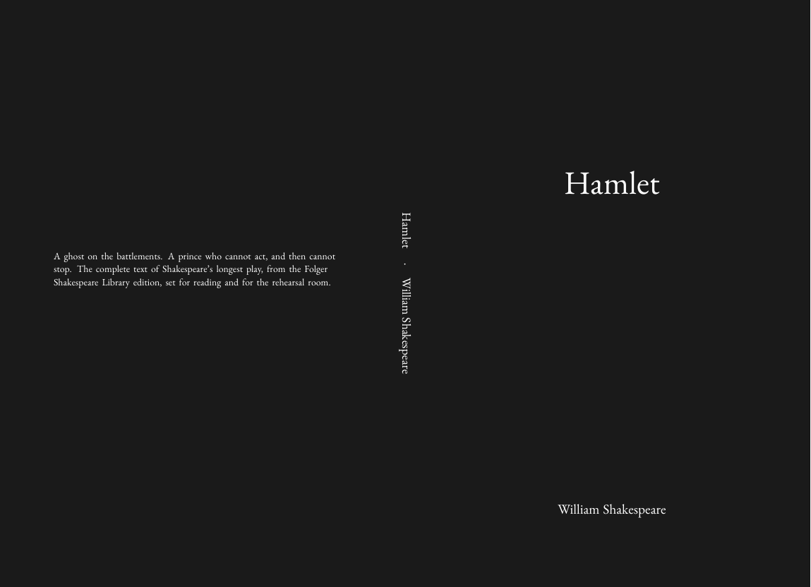
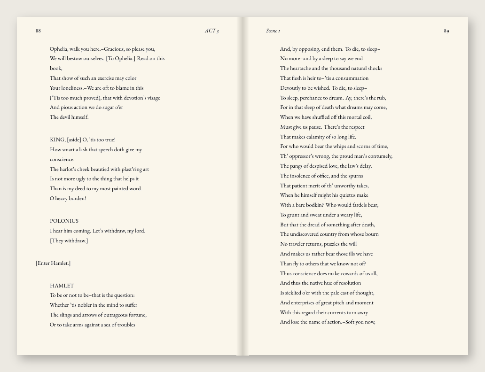

# Example session: Hamlet, from plain text to KDP paperback

A complete run on `example/hamlet.txt`, the Folger Shakespeare Library text of
*Hamlet* (a 177 KB plain-text file with no formatting). The person is fictional:
a drama teacher who wants a rehearsal copy for their students. **Every tool
output below is real**, copied from the run that produced the images in
`docs/images/`.

The one thing the tool did not do is write anything. The title, the author
line and the back-cover blurb are the user's words, used verbatim.

---

### 0. Find the manuscript and check the machine

> **You:** `/kdp-book example/hamlet.txt`

> **Claude:** First, the KDP wiki. It isn't built on this machine yet, so I'm
> building it now. Every KDP rule I use gets looked up there.
>
> ```
> $ kdp wiki build
> Fetching the KDP Help Center (cached pages are reused) ...
> done: 340 topics cached (2 dead links skipped)
> 281 topics, 11 sections, 19 reachable only by cross-reference; 54 alias ids folded in, 5 empty stubs dropped
> Graph: 292 nodes, 1259 edges -> wiki/graph.json
> ```
>
> `kdp doctor` found a LaTeX engine, every TeX package, EB Garamond and the
> English hyphenation patterns. Nothing is missing, so we can go straight to
> your book.

### 1. Analyse, and ask nothing yet

> **Claude:** Here's what I found in `hamlet.txt`:
>
> ```
>   note: Inferred 6 chapters and 20 sections from underlined titles (=== and ---). Confirm before building.
> What I found
>   6 chapters, 20 sections, 31,924 words, 0 images
>   Language: en (high confidence)
>   Dialogue uses straight quotes (71 passages)
>   Paragraphs average 14 words
>
> Worth a look
>   - 1 block(s) appear before the first chapter heading; they will be treated as front matter.
>   - Chapter(s) [1] are far shorter than average (1649 words) - front matter or an interlude, perhaps?
> ```
>
> A plain-text file has no real headings, so I **inferred** the structure from
> the underlines. I read it as *Characters in the Play* plus **5 acts** and **20
> scenes** in total. Is that right?
>
> Two things are worth a look:
> - The first "chapter" is the cast list, which is why it's so short. That's
>   expected for a play.
> - The Folger credit at the top of the file (editors, source URL) will be set
>   as front matter. Keep it, or drop it?

> **You:** Yes, five acts. Keep the Folger credit: it's their edition, and
> they should be credited.

### 2. What kind of book?

> **Claude:** It looks like **drama**. That setting applies a whole row of
> defaults, and each one comes with its reason:
>
> - **6 × 9 in**: "A wide measure keeps verse lines from wrapping; a wrapped
>   pentameter reads as a mistake."
> - **Contents lists acts *and* scenes**: "a reader or a class is looking for
>   II.ii, not page 74."
> - **Speeches set flush, no indent**, and **the act in the running head**,
>   because a play is referenced, not just read.

> **You:** Drama, yes.

### 3. Identity

> **Claude:** The file doesn't state a title in a form I can rely on, and I
> won't take one from a heading. What should the cover say, and whose name
> goes on it?

> **You:** "Hamlet", by William Shakespeare.

### 4–7. Format, trim, paper, typography

> **Claude:** Paperback, plus an ebook (you get both unless you say
> otherwise). For trim size, `analyse` estimates:
>
> ```
>   5.0x8.0in - about 131 pages, spine 0.33in
>   5.5x8.5in - about 111 pages, spine 0.28in  (most common for prose)
>   6.0x9.0in - about 93 pages, spine 0.23in
> ```
>
> These are estimates from prose density. Verse sets much looser, so the real
> page count comes from the build. Do you have a preference?

> **You:** No idea, honestly.

> **Claude:** Then 6 × 9, the drama default, so the verse doesn't wrap.
> Paper is **cream**, black ink: there are no images, so colour would add cost
> for nothing. Typography is EB Garamond 11 pt, the drama default. Want to see
> a sample page first?

> **You:** No, go ahead.

### 9. Cover

> **Claude:** There's no artwork, so I'll use the plain type cover. I need the
> back-cover text **in your words**; I don't write blurbs.

> **You:** "A ghost on the battlements. A prince who cannot act, and then cannot
> stop. The complete text of Shakespeare's longest play, from the Folger
> Shakespeare Library edition, set for reading and for the rehearsal room."

### 10. Build and report

```
$ kdp build hamlet.txt --book-type drama --title "Hamlet" --author "William Shakespeare" --blurb "A ghost on the battlements. …"
  interior: 203 pages (1 rendering pass(es)) -> hamlet-paperback-interior.pdf
  preflight: 14/14 checks passed, 0 error(s), 0 warning(s)
  cover: paperback cover 12.758" x 9.250" (spine 0.508" at 203 pages) -> hamlet-paperback-cover.pdf
  preflight: 12/12 checks passed, 0 error(s), 0 warning(s)
  ebook: hamlet-ebook.epub (valid)
```

> **Claude:** Done. The real count is **203 pages**, more than the estimate,
> as expected for verse. The spine is **0.508"**, computed from those 203 pages
> on cream paper, so the cover was built for exactly this interior. Every
> check passed: 14 on the interior, 12 on the cover.
>
> | Upload to KDP field | File (in `./build/`) |
> |---|---|
> | Paperback manuscript | `hamlet-paperback-interior.pdf` |
> | Paperback cover | `hamlet-paperback-cover.pdf` |
> | eBook manuscript | `hamlet-ebook.epub` |
>
> All settings are saved to `build/book.yaml`, so a rebuild asks nothing.

<p align="center">
  
</p>
<p align="center">
  
</p>

---

### Afterwards: `/kdp-chat`

> **You:** `/kdp-chat how much will each copy cost to print, and what do I do next?`

> **Claude:**
> ```
> $ kdp wiki search "paperback printing cost black ink per page"
> 1. Paperback Printing Cost  [KDP Publishing]  score 25.74
>    wiki/topics/paperback-printing-cost.md
> 2. Color Ink Options  [KDP Publishing]  score 24.44
> $ kdp wiki search "how do I order a proof copy"
> 1. Proof and Author Copies  [Orders & Book Copies]  score 10.52
> 2. I'm getting an error ordering my proof copy  [Orders & Book Copies]  score 10.47
> 3. How do I order a proof or author copy?  [Orders & Book Copies]  score 10.41
> ```
>
> **Printing cost.** Your book is black ink on cream, 203 pages, 6 × 9 (a
> regular trim: not wider than 6.12" or taller than 9"). KDP's formula is
> *fixed cost + page count × per-page cost*, and for Amazon.com, black ink,
> 110–828 pages, that's 1.00 USD + 203 × 0.012 USD = **3.44 USD per copy**.
> KDP subtracts it from royalties, so there's nothing to pay up front.
> ([Paperback Printing Cost](https://kdp.amazon.com/en_US/help/topic/G201834340))
>
> **Next steps**, from your build and KDP's publishing flow:
> 1. **ISBN.** Paperbacks can use a free KDP ISBN (*Edit Paperback Content →
>    ISBN → Get free KDP ISBN*). ([Get an ISBN](https://kdp.amazon.com/en_US/help/topic/GTJ8LBXL6Z4WV5QX))
> 2. **Upload** the two PDFs from the table above and approve the book in
>    Print Previewer.
> 3. **Order a proof.** From the Bookshelf "…" menu, choose *Request Printed
>    Proofs*, up to 5 copies, charged at the print cost. Proof copies don't
>    qualify for free or Prime shipping.
>    ([How do I order a proof or author copy?](https://kdp.amazon.com/en_US/help/topic/GVEG4YA9G2T7N6DR))
>
> One thing the build can't settle for you: the Folger text is licensed
> CC BY-NC 3.0, which doesn't allow commercial use. You can print rehearsal
> copies for your class, but not list this edition for sale.
